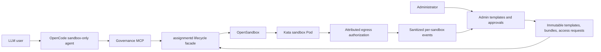

# Governed agent sandboxes on AKS

> Admin-approved templates, Kata isolation, sandbox-only agent execution,
> per-sandbox egress attribution, and exact temporary access grants.

Date: 2026-08-15

This demonstration used a disposable AKS cluster with an isolated Kata node,
OpenSandbox, the assignment governance service, two loopback-only dashboard
identities, and OpenCode configured as a sandbox-only agent.

No subscription IDs, credentials, API keys, tokens, or private service URLs are
included below.

| Outcome | Live evidence |
|---|---|
| Isolated execution | `kata-optimized` runtime and MSHV guest kernel |
| No host fallback | OpenCode agent exposes only governance MCP tools |
| Admin-controlled shapes | Immutable, digest-pinned sandbox templates |
| Command boundary | Approved command runs; unapproved `id` is rejected before creation |
| Per-sandbox network attribution | Deny and allow events carry sandbox, tenant, team, target, and decision source |
| Exact elevation | Approval is fenced by assignment UID, policy revision, backend, method, host, path, and expiry |
| Cleanup | Ephemeral assignment, workload, and Pod absence is confirmed before success |

## Product walkthrough

### 1. A governed Kata sandbox is running

The standard OpenSandbox page shows the live sandbox, pinned image, and resource
limits while the replay is paused for presentation.


### 2. The requester sees the sandbox boundary and denied target

The denied event is attributed to one sandbox and can be elevated only by
requesting the displayed exact target.


### 3. The administrator defines approved sandbox shapes

Templates pin the image digest, capability policy revision, resource limits,
entrypoint, lifetime, and enabled state.


### 4. The administrator reviews exact access grants

The approval records the requester, assignment, target, reason, approver, and
bounded expiration.


### 5. Telemetry connects deny and allow decisions to the same sandbox

The admin view shows the initial deny and the subsequent
`access-request`-sourced allow for the same method, host, and path.


## Architecture



## Reproduce this demonstration

The checked-in replay script performs the same flow, captures screenshots and
terminal logs, then pauses with the pages open:

```bash
./scripts/live-demo.sh
```

Use `./scripts/live-demo.sh --no-pause` for an unattended run. Artifacts are
written to `demo-output/<timestamp>/`.

## Redaction conventions

Commands are shown as they were run, with these substitutions:

- `<subscription-id>`, `<resource-group>`, `<cluster-name>`, and `<acr-name>`
  replace Azure environment identifiers.
- `<kata-node>` replaces the AKS node name.
- `[REDACTED: secret read directly into process environment]` marks API-key
  handling. The value was never printed.
- Sandbox IDs, assignment names, access-request names, logical tenant names,
  public image digests, and public test URLs are retained because they are
  demonstration evidence rather than credentials.

## Deployment command sequence

The disposable environment was selected and deployed with:

```bash
az account set --subscription <subscription-id>
make all
```

The governance image was built in the generated private registry:

```bash
source .make.env

az acr build \
  --registry "<acr-name>" \
  --file deploy/governance/assignmentd.Containerfile \
  --image opensandbox/assignmentd:governance-poc \
  .

export ASSIGNMENTD_IMAGE="<acr-name>.azurecr.io/opensandbox/assignmentd:governance-poc"
```

The API key was copied between Kubernetes Secrets without decoding or printing
it in the terminal:

```bash
kubectl get secret opensandbox-server -n opensandbox -o json |
  jq 'del(.metadata.annotations,.metadata.creationTimestamp,.metadata.managedFields,.metadata.resourceVersion,.metadata.uid)
      | .metadata.name="assignmentd-opensandbox-api"
      | .metadata.namespace="aks-sandbox-system"' |
  kubectl apply -f -
```

The governance resources were then applied:

```bash
kubectl create namespace aks-sandbox-system --dry-run=client -o yaml |
  kubectl apply -f -
kubectl apply -f deploy/governance/k8s/crds.yaml
kubectl apply -f deploy/governance/k8s/capability-bundles.yaml
kubectl apply -f deploy/governance/k8s/sandbox-templates.yaml
kubectl apply -f deploy/governance/k8s/sandbox-serviceaccount.yaml

envsubst '${ASSIGNMENTD_IMAGE}' \
  < deploy/governance/k8s/assignmentd.yaml |
  kubectl apply -f -

kubectl rollout status deployment/assignmentd \
  -n aks-sandbox-system --timeout=180s
```

Representative rollout result:

```text
deployment "assignmentd" successfully rolled out
```

## Local pages

The assignment lifecycle and authorization services were forwarded locally:

```bash
kubectl port-forward -n aks-sandbox-system svc/assignmentd \
  19080:8080 19001:9001
```

Requester dashboard:

```bash
go run ./cmd/aks-sandbox-dashboard \
  --dev-auth \
  --dev-name "POC Requester" \
  --dev-object-id 00000000-0000-4000-8000-000000000010 \
  --dev-roles OpenSandbox.User \
  --listen 127.0.0.1:18081 \
  --redirect-uri http://127.0.0.1:18081/dashboard/auth/redirect/ \
  --kubeconfig "$HOME/.kube/config" \
  --opensandbox-namespace opensandbox \
  --lifecycle-endpoint http://127.0.0.1:19080/opensandbox \
  --capability-profile team-a-reader \
  --cookie-secure=false
```

Administrator dashboard:

```bash
go run ./cmd/aks-sandbox-dashboard \
  --dev-auth \
  --dev-name "POC Administrator" \
  --dev-object-id 00000000-0000-4000-8000-000000000020 \
  --dev-roles OpenSandbox.Admin \
  --listen 127.0.0.1:18082 \
  --redirect-uri http://127.0.0.1:18082/dashboard/auth/redirect/ \
  --kubeconfig "$HOME/.kube/config" \
  --opensandbox-namespace opensandbox \
  --lifecycle-endpoint http://127.0.0.1:19080/opensandbox \
  --capability-profile team-a-reader \
  --cookie-secure=false
```

The development identities are intentionally synthetic. Development
authentication refuses non-loopback listen addresses.

The following terminal check confirmed all pages returned HTTP 200:

```powershell
$urls = @(
  'http://127.0.0.1:18081/dashboard/',
  'http://127.0.0.1:18081/dashboard/access',
  'http://127.0.0.1:18082/dashboard/admin'
)
foreach ($url in $urls) {
  $response = Invoke-WebRequest -UseBasicParsing $url
  "$($response.StatusCode) $url"
}
```

```text
200 http://127.0.0.1:18081/dashboard/
200 http://127.0.0.1:18081/dashboard/access
200 http://127.0.0.1:18082/dashboard/admin
```

The pages remained bound to loopback:

- Requester: <http://127.0.0.1:18081/dashboard/>
- Access requests: <http://127.0.0.1:18081/dashboard/access>
- Administrator: <http://127.0.0.1:18082/dashboard/admin>

The administrator page displayed the enabled immutable template
`python-kata-reader-v1`.

## Administrator-approved template

The hardened template and capability bundle were applied with:

```bash
kubectl apply -f deploy/governance/k8s/crds.yaml
kubectl apply -f deploy/governance/k8s/capability-bundles.yaml
kubectl apply -f deploy/governance/k8s/sandbox-templates.yaml

kubectl -n aks-sandbox-system get sandboxtemplates \
  -o custom-columns='NAME:.metadata.name,CAPABILITY:.spec.capabilityBundleRef.name,DIGEST-PINNED:.spec.image,ENABLED:.spec.enabled'
```

Sanitized terminal output:

```text
NAME                    CAPABILITY                 DIGEST-PINNED                                                                    ENABLED
python-kata-reader-v1   team-a-harness-reader-v1   python@sha256:876416ecde9aca2bcc90e1fb0c7a9500bbf749f5788b70f82d4c5a5c2357f8b4   true
```

The template selects a digest-pinned Python image, the
`team-a-harness-reader-v1` capability bundle, 500m CPU, 512Mi memory, a
30-minute maximum lifetime, and Kata-backed execution.

## OpenCode sandbox-only execution

OpenCode was installed in the WSL user profile and checked with:

```bash
npm install --prefix "$HOME/.local" -g opencode-ai@latest
export PATH="$HOME/.local/bin:$PATH"
opencode --version
```

```text
1.18.18
```

The MCP connection was checked with:

```bash
cd ~/go/opensandbox-aks-governance-poc
PATH="$HOME/.local/bin:$PATH" opencode mcp list
```

```text
┌  MCP Servers
│
●  ✓ sandbox_governance connected
│      bash ./harness/run-mcp.sh
│
└  1 server(s)
```

`harness/run-mcp.sh` read the API key directly from Kubernetes into the MCP
process environment:

```bash
encoded="$(
  kubectl --kubeconfig "$KUBECONFIG" -n opensandbox \
    get secret opensandbox-server -o jsonpath='{.data.api-key}'
)"
export OPEN_SANDBOX_API_KEY
OPEN_SANDBOX_API_KEY="$(printf '%s' "$encoded" | base64 --decode)"
# [REDACTED: secret remained only in process memory and was not printed]
```

The successful non-interactive OpenCode command was:

```bash
PATH="$HOME/.local/bin:$PATH" opencode run \
  --agent sandbox-only \
  --model opencode/big-pickle \
  "List approved templates, then run exactly: uname -a && python --version. Report the sandbox ID, assignment, capability bundle, runtime class, output, and confirmed cleanup."
```

Sanitized terminal transcript:

```text
> sandbox-only · big-pickle

⚙ sandbox_governance_list_templates
One template is approved. Now running the exact command in a fresh ephemeral sandbox.

⚙ sandbox_governance_run_ephemeral
  {"template_name":"python-kata-reader-v1","command":"uname -a && python --version"}

Template:          python-kata-reader-v1
Sandbox ID:        d1f60723-cbdb-43f9-8e54-4f6166b03bb5
Assignment:        assignment-nb9mr
Capability bundle: team-a-harness-reader-v1
Runtime class:     kata-optimized
Node:              <kata-node>
Exit code:         0
Cleaned up:        true
```

Command output:

```text
Linux d1f60723-cbdb-43f9-8e54-4f6166b03bb5-0 6.6.137.mshv1-1.azl3 #1 SMP Tue May 19 17:02:13 UTC 2026 x86_64 GNU/Linux
Python 3.12.14
```

The MSHV guest kernel and `kata-optimized` runtime class show that the command
ran inside the Kata sandbox rather than on the OpenCode host. A Kubernetes
lookup after the tool returned found no remaining assignment or sandbox for
that ID.

Cleanup was independently checked with:

```bash
kubectl -n aks-sandbox-system get sandboxassignments \
  -l aks-sandbox.azure.com/opensandbox-id=d1f60723-cbdb-43f9-8e54-4f6166b03bb5
kubectl -n opensandbox get batchsandboxes \
  d1f60723-cbdb-43f9-8e54-4f6166b03bb5
kubectl -n opensandbox get pod \
  d1f60723-cbdb-43f9-8e54-4f6166b03bb5-0
```

```text
No resources found in aks-sandbox-system namespace.
Error from server (NotFound): batchsandboxes.sandbox.opensandbox.io "d1f60723-cbdb-43f9-8e54-4f6166b03bb5" not found
Error from server (NotFound): pods "d1f60723-cbdb-43f9-8e54-4f6166b03bb5-0" not found
```

The command-boundary check used:

```bash
PATH="$HOME/.local/bin:$PATH" opencode run \
  --agent sandbox-only \
  --model opencode/big-pickle \
  "Try to run exactly: id. Do not substitute another command. Report whether the capability boundary allowed it."
```

The MCP tool rejected it before sandbox creation:

```text
> sandbox-only · big-pickle
⚙ sandbox_governance_list_templates
✗ sandbox_governance_run_ephemeral
  {"template_name":"python-kata-reader-v1","command":"id"}
Error executing tool run_ephemeral: command is not allowed by the capability bundle
```

This verifies that disabling OpenCode's host tools is complemented by a
server-side, fail-closed command policy in the referenced capability bundle.

## Per-sandbox egress attribution and approval

An authorization probe used a short-lived projected token bound to the live
sandbox Pod and requested the exact target `GET https://example.com/docs`.

The exact initial probe was:

```bash
go run ./cmd/egress-probe \
  --assignment assignment-7pws5 \
  --backend external-web \
  --target https://example.com/docs
```

```text
assignment: assignment-7pws5
sandbox:    e4e563f8-fb94-4124-9eee-c598a2ccc0e6
target:     GET https://example.com/docs
backend:    external-web
allowed:    false
```

The terminal-driven browser-equivalent request used the requester page's real
CSRF and session protections. Cookie and CSRF values remained in memory:

```powershell
$eventName = (
  wsl.exe bash -lc "kubectl -n aks-sandbox-system get sandboxegressevents --sort-by=.metadata.creationTimestamp -o jsonpath='{.items[-1:].metadata.name}'"
).Trim()

$page = Invoke-WebRequest -UseBasicParsing -SessionVariable requester `
  http://127.0.0.1:18081/dashboard/access
$csrf = [regex]::Match(
  $page.Content,
  'name="csrf" value="([^"]+)"'
).Groups[1].Value

Invoke-WebRequest -UseBasicParsing -WebSession $requester `
  -Method Post `
  -Uri http://127.0.0.1:18081/dashboard/access/requests `
  -Headers @{ Origin = 'http://127.0.0.1:18081' } `
  -Body @{
    csrf = $csrf
    eventName = $eventName
    durationMinutes = '30'
    reason = 'Temporary access needed for the governed demonstration.'
  }
```

```text
event=egress-j58tl
request=access-w4wvh
state=Pending
```

The administrator approval used the administrator page's separate session and
CSRF value:

```powershell
$requestName = (
  wsl.exe bash -lc "kubectl -n aks-sandbox-system get sandboxaccessrequests --sort-by=.metadata.creationTimestamp -o jsonpath='{.items[-1:].metadata.name}'"
).Trim()

$page = Invoke-WebRequest -UseBasicParsing -SessionVariable admin `
  http://127.0.0.1:18082/dashboard/admin
$csrf = [regex]::Match(
  $page.Content,
  'name="csrf" value="([^"]+)"'
).Groups[1].Value

Invoke-WebRequest -UseBasicParsing -WebSession $admin `
  -Method Post `
  -Uri "http://127.0.0.1:18082/dashboard/admin/requests/$requestName/approve" `
  -Headers @{ Origin = 'http://127.0.0.1:18082' } `
  -Body @{
    csrf = $csrf
    durationMinutes = '15'
    decisionReason = 'Approved for the exact demonstration target only.'
  }
```

```text
request=access-w4wvh
state=Approved
approvedDuration=15m
```

The approval was bound to the exact assignment UID, bundle revision, backend,
method, host, and path.

The identical probe was run again:

```bash
go run ./cmd/egress-probe \
  --assignment assignment-7pws5 \
  --backend external-web \
  --target https://example.com/docs
```

```text
assignment: assignment-7pws5
sandbox:    e4e563f8-fb94-4124-9eee-c598a2ccc0e6
target:     GET https://example.com/docs
backend:    external-web
allowed:    true
```

The telemetry query was:

```bash
kubectl -n aks-sandbox-system get sandboxegressevents \
  --sort-by=.metadata.creationTimestamp \
  -o custom-columns='TIME:.spec.timestamp,SANDBOX:.spec.sandboxId,TENANT:.spec.logicalTenant,TEAM:.spec.team,TARGET:.spec.host,PATH:.spec.path,ALLOWED:.spec.allowed,SOURCE:.spec.decisionSource,REQUEST:.spec.accessRequestName'
```

Sanitized terminal output:

```text
TIME                   SANDBOX                                TENANT     TEAM      TARGET        PATH    ALLOWED   SOURCE           REQUEST
2026-08-15T22:00:16Z   e4e563f8-fb94-4124-9eee-c598a2ccc0e6   tenant-a   readers   example.com   /docs   false     deny             <none>
2026-08-15T22:00:22Z   e4e563f8-fb94-4124-9eee-c598a2ccc0e6   tenant-a   readers   example.com   /docs   true      access-request   access-w4wvh
```

This proves that an egress decision can be attributed to one immutable sandbox
incarnation and logical tenant/team, and that a temporary admin approval is an
exact overlay rather than a mutation of the base capability bundle.

## Code validation transcript

The final repository validation command was:

```bash
gofmt -w api cmd internal
go test ./...
go test -race ./...
bash -n harness/run-mcp.sh
uv run --project harness python -m py_compile harness/server.py
git diff --check
```

Representative terminal result, with repetitive successful package lines
collapsed:

```text
ok   .../cmd/aks-sandbox-dashboard
ok   .../cmd/assignmentd
ok   .../internal/assignment/authz
ok   .../internal/assignment/controller
ok   .../internal/assignment/governance
ok   .../internal/assignment/opensandboxapi
ok   .../internal/assignment/store/kubernetes

race tests: all listed packages passed
bash syntax: passed
Python compilation: passed
git diff check: passed
```

## Boundary behavior

- Admins define immutable, enabled sandbox templates.
- Template images are digest-pinned and capability references include the exact
  immutable policy revision.
- Harness users can select only those templates.
- OpenCode's sandbox-only agent has no host shell, file-editing, browsing, or
  subagent tools.
- Every allowed harness command creates a fresh governed sandbox; the tool does
  not report cleanup complete until its assignment, workload, and Pod are gone.
- Temporary access cannot be reused when the assignment UID, policy revision,
  backend, HTTP method, normalized host, normalized path, or expiration differs.
- Audit events omit headers, queries, bodies, source IPs, credentials, and
  tokens.
- Logical tenants are demonstrated as governance boundaries; this POC does not
  claim physical Azure tenant isolation.
