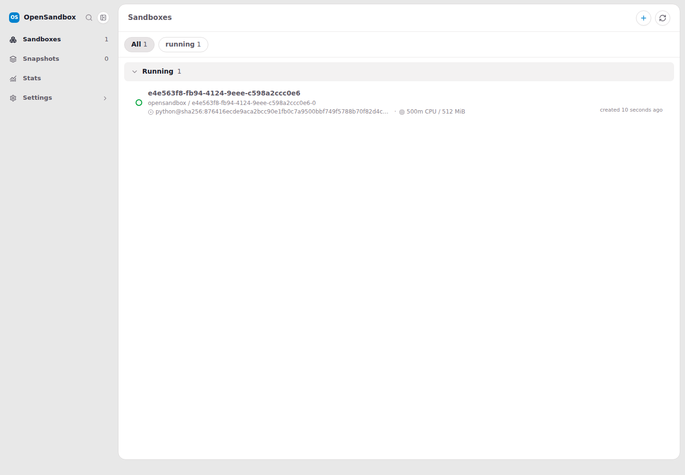
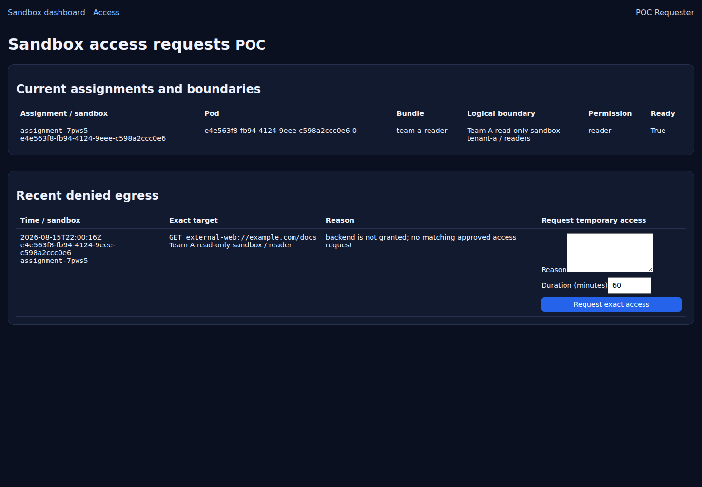
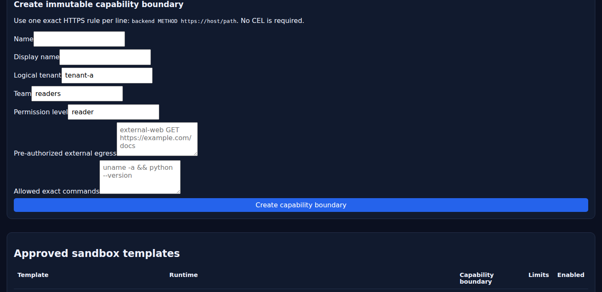
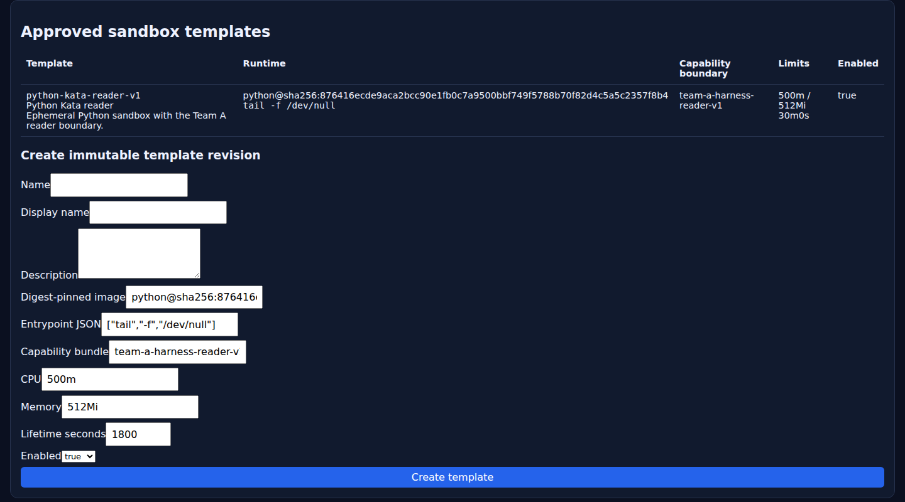
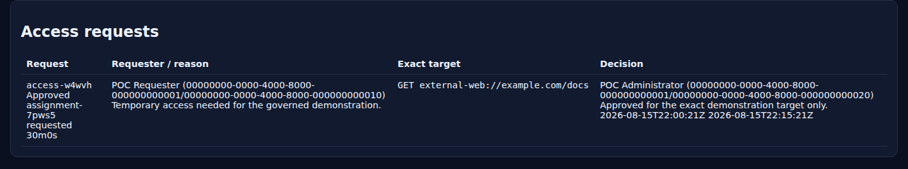
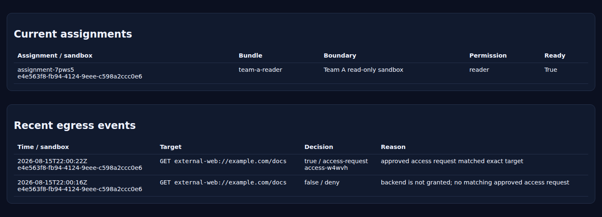
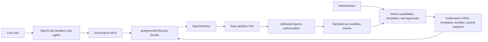

# Governed agent sandboxes on AKS

> Admin-approved templates, Kata isolation, sandbox-only agent execution,
> per-sandbox egress attribution, and exact temporary access grants.

See [P0 managed-service boundary findings](p0-service-boundary-findings.md) for
the security, durability, tenancy, egress, and operability assessment.

Date: 2026-08-15

This demonstration used a disposable AKS cluster with an isolated Kata node,
OpenSandbox, the assignment governance service, two loopback-only dashboard
identities, and OpenCode configured as a sandbox-only agent.

No subscription IDs, credentials, API keys, tokens, or private service URLs are
included below.

| Outcome | Live evidence |
|---|---|
| Isolated execution | `kata-optimized` runtime and MSHV guest kernel |
| No host fallback | OpenCode agent exposes only governance MCP tools |
| Admin-controlled shapes | Immutable capability boundaries and digest-pinned sandbox templates |
| Command boundary | Approved command runs; unapproved `id` is rejected before creation |
| Per-sandbox network attribution | Deny and allow events carry sandbox, tenant, team, target, and decision source |
| Exact elevation | Approval is fenced by assignment UID, policy revision, backend, method, host, path, and expiry |
| Tenant budgets | Admission limits bundle revisions, concurrency, lifetime, CPU, memory, and access duration |
| Governed validation | Changed paths select exact sandbox-only commands; durable evidence stores output hashes |
| Lifecycle authority | Broker grants and temporary access are bound to the current Pod UID |
| Snapshot continuity | State survives pause/resume while pre-snapshot authority becomes invalid |
| Cleanup | Ephemeral assignment, workload, and Pod absence is confirmed before success |

## Product walkthrough

### 1. A governed Kata sandbox is running

The standard OpenSandbox page shows the live sandbox, pinned image, and resource
limits while the replay is paused for presentation.



### 2. The requester sees the sandbox boundary and denied target

The denied event is attributed to one sandbox and can be elevated only by
requesting the displayed exact target.



### 3. The administrator pre-encodes capabilities and sandbox shapes

The admin page converts simple exact entries such as
`external-web GET https://example.com/docs` into the capability policy. No CEL
authoring is required. Explicit ports, query strings, and fragments are
rejected rather than normalized into a broader rule. Allowed commands are
entered as exact strings rather than arbitrary regular expressions.



Templates then select the resulting boundary and pin the image digest,
capability policy revision, resource limits, entrypoint, lifetime, and enabled
state.



### 4. The administrator reviews exact access grants

The approval records the requester, assignment, target, reason, approver, and
bounded expiration.



### 5. Telemetry connects deny and allow decisions to the same sandbox

The admin view shows the initial deny and the subsequent
`access-request`-sourced allow for the same method, host, and path.



## Architecture



## Egress identity limitation and production path

The live environment explicitly runs `assignmentd` in `external-mediator`
identity mode. Upstream OpenSandbox currently replaces additional containers
from the base Pod template during sandbox creation, so this integration cannot
reliably preserve a trusted egress sidecar next to the user-controlled
container.

The live authorization path therefore keeps credentials outside the sandbox:

1. The sandbox Pod disables automatic ServiceAccount token mounting and
   contains no projected Kubernetes token.
2. A trusted external probe or gateway requests a short-lived,
   audience-restricted token bound to the exact Pod UID.
3. `assignmentd` verifies that token and fences the decision by assignment,
   capability revision, backend, method, normalized host, normalized path, and
   temporary-grant expiration.
4. The decision is emitted as sanitized, per-sandbox telemetry.

This demonstrates authorization and attribution rather than transparent
interception of every sandbox network connection.

`projected-sidecar` remains the fail-closed controller default for production.
A mutating admission webhook or equivalent integration would inject the egress
proxy and mount the Pod-bound identity only into that trusted sidecar. The user
container would not receive the credential. A missing or malformed sidecar,
identity projection, or isolation boundary keeps the assignment unready and
denies mediated egress.

## Reproduce this demonstration

The checked-in replay script performs the same flow, captures screenshots and
terminal logs, then pauses with the pages open:

```bash
./scripts/live-demo.sh
```

Use `./scripts/live-demo.sh --no-pause` for an unattended run. Artifacts are
written to `demo-output/<timestamp>/`.

The replay creates its demonstration capability boundary and template through
the admin HTTP workflow, verifies that the corresponding Kubernetes custom
resources exist, and removes them during cleanup.

The companion replay exercises the newer governance experiments:

```bash
./scripts/extended-governance-demo.sh
```

It runs the readiness doctor, displays logical-tenant budgets, executes
automatic sandbox validation, proves short-lived credential revocation and
replay denial, and pauses/snapshots/resumes a sandbox while verifying state
continuity, Pod UID rotation, and rejection of pre-snapshot authority.

The script creates Kubernetes Secret `assignmentd-credential-broker` from an
`openssl`-generated value piped directly to `kubectl`, then unsets the shell
value. The key is not printed or committed. Terminal evidence is written under
`demo-output/<timestamp>-extended/`.

The live extended replay completed on 2026-08-16. Representative sanitized
evidence:

```text
doctor.ready: true
governance inventory: 3 enabled templates, 10 bundles, 2 enabled tenant policies
tenant-a budget: 4 concurrent, 3600s lifetime, 2 CPU, 2Gi memory
tenant-b budget: 2 concurrent, 1800s lifetime, 1 CPU, 1Gi memory
```

The readiness contract passed all hard requirements and reported one explicit
production warning: the shared workload namespace did not yet have a
`NetworkPolicy`.

```text
validation run: validation-vk4x6
state: Succeeded
template: python-kata-reader-v2
runtime class: kata-optimized
stdout hash: sha256:b236a58c2789594cb8d8ce2823d4009b00ba9a5e98555bcb979c077576def623
stderr hash: sha256:e3b0c44298fc1c149afbf4c8996fb92427ae41e4649b934ca495991b7852b855
cleanup: true
```

The credential exercise recorded `issued`, `used`, and `revoked` audit actions
for exact `GET https://example.com/docs` scope. The tool then proved replay
denial without returning or persisting the credential.

```text
snapshot state preserved: true
old Pod UID: 5c6cef70-da56-4b57-bbe1-69e644a2a52a
new Pod UID: 85c64fff-7a18-45df-a721-90955dbb6a3e
Pod identity rotated: true
pre-snapshot credential rejected: true
cleanup: true
```

## Kubernetes-native source of truth

The admin page is intentionally a convenience layer over Kubernetes APIs.
`CapabilityBundle` and `SandboxTemplate` CRDs are the declarative source of
truth; the UI does not maintain a separate database or proprietary template
format. All current and future template capabilities should remain expressible
as versioned custom resources so operators can use YAML, GitOps, Helm,
Kustomize, policy admission, and normal Kubernetes RBAC.

## Redaction conventions

Commands are shown as they were run, with these substitutions:

- `<subscription-id>`, `<resource-group>`, `<cluster-name>`, and `<acr-name>`
  replace Azure environment identifiers.
- `<kata-node>` replaces the AKS node name.
- `[REDACTED: secret read directly into process environment]` marks API-key
  handling. The value was never printed.
- Sandbox IDs, assignment names, access-request names, logical tenant names,
  public image digests, and public test URLs are retained because they are
  demonstration evidence rather than credentials.

## Deployment command sequence

The disposable environment was selected and deployed with:

```bash
az account set --subscription <subscription-id>
make all
```

The governance image was built in the generated private registry:

```bash
source .make.env

az acr build \
  --registry "<acr-name>" \
  --file deploy/governance/assignmentd.Containerfile \
  --image opensandbox/assignmentd:governance-poc \
  .

export ASSIGNMENTD_IMAGE="<acr-name>.azurecr.io/opensandbox/assignmentd:governance-poc"
```

The API key was copied between Kubernetes Secrets without decoding or printing
it in the terminal:

```bash
kubectl get secret opensandbox-server -n opensandbox -o json |
  jq 'del(.metadata.annotations,.metadata.creationTimestamp,.metadata.managedFields,.metadata.resourceVersion,.metadata.uid)
      | .metadata.name="assignmentd-opensandbox-api"
      | .metadata.namespace="aks-sandbox-system"' |
  kubectl apply -f -
```

The governance resources were then applied:

```bash
kubectl create namespace aks-sandbox-system --dry-run=client -o yaml |
  kubectl apply -f -
kubectl apply -f deploy/governance/k8s/crds.yaml
kubectl apply -f deploy/governance/k8s/capability-bundles.yaml
kubectl apply -f deploy/governance/k8s/sandbox-templates.yaml
kubectl apply -f deploy/governance/k8s/tenant-policies.yaml
kubectl apply -f deploy/governance/k8s/sandbox-serviceaccount.yaml

envsubst '${ASSIGNMENTD_IMAGE}' \
  < deploy/governance/k8s/assignmentd.yaml |
  kubectl apply -f -

kubectl rollout status deployment/assignmentd \
  -n aks-sandbox-system --timeout=180s
```

Representative rollout result:

```text
deployment "assignmentd" successfully rolled out
```

## Local pages

The assignment lifecycle and authorization services were forwarded locally:

```bash
kubectl port-forward -n aks-sandbox-system svc/assignmentd \
  19080:8080 19001:9001
```

Requester dashboard:

```bash
go run ./cmd/aks-sandbox-dashboard \
  --dev-auth \
  --dev-name "POC Requester" \
  --dev-object-id 00000000-0000-4000-8000-000000000010 \
  --dev-roles OpenSandbox.User \
  --listen 127.0.0.1:18081 \
  --redirect-uri http://127.0.0.1:18081/dashboard/auth/redirect/ \
  --kubeconfig "$HOME/.kube/config" \
  --opensandbox-namespace opensandbox \
  --lifecycle-endpoint http://127.0.0.1:19080/opensandbox \
  --capability-profile team-a-reader \
  --cookie-secure=false
```

Administrator dashboard:

```bash
go run ./cmd/aks-sandbox-dashboard \
  --dev-auth \
  --dev-name "POC Administrator" \
  --dev-object-id 00000000-0000-4000-8000-000000000020 \
  --dev-roles OpenSandbox.Admin \
  --listen 127.0.0.1:18082 \
  --redirect-uri http://127.0.0.1:18082/dashboard/auth/redirect/ \
  --kubeconfig "$HOME/.kube/config" \
  --opensandbox-namespace opensandbox \
  --lifecycle-endpoint http://127.0.0.1:19080/opensandbox \
  --capability-profile team-a-reader \
  --cookie-secure=false
```

The development identities are intentionally synthetic. Development
authentication refuses non-loopback listen addresses.

The following terminal check confirmed all pages returned HTTP 200:

```powershell
$urls = @(
  'http://127.0.0.1:18081/dashboard/',
  'http://127.0.0.1:18081/dashboard/access',
  'http://127.0.0.1:18082/dashboard/admin'
)
foreach ($url in $urls) {
  $response = Invoke-WebRequest -UseBasicParsing $url
  "$($response.StatusCode) $url"
}
```

```text
200 http://127.0.0.1:18081/dashboard/
200 http://127.0.0.1:18081/dashboard/access
200 http://127.0.0.1:18082/dashboard/admin
```

The pages remained bound to loopback:

- Requester: <http://127.0.0.1:18081/dashboard/>
- Access requests: <http://127.0.0.1:18081/dashboard/access>
- Administrator: <http://127.0.0.1:18082/dashboard/admin>

The administrator page displayed the enabled immutable templates and the
capability-boundary editor.

## Administrator-approved capability and template

For the live replay, the administrator submitted this human-readable boundary
through the page:

```text
external-web GET https://example.com/docs
```

The server normalized the method, host, and path, generated an exact policy,
and created a Kubernetes `CapabilityBundle`. The administrator then selected
that bundle while creating a digest-pinned `SandboxTemplate`. The same objects
can be defined declaratively:

The hardened template and capability bundle were applied with:

```bash
kubectl apply -f deploy/governance/k8s/crds.yaml
kubectl apply -f deploy/governance/k8s/capability-bundles.yaml
kubectl apply -f deploy/governance/k8s/sandbox-templates.yaml

kubectl -n aks-sandbox-system get sandboxtemplates \
  -o custom-columns='NAME:.metadata.name,CAPABILITY:.spec.capabilityBundleRef.name,DIGEST-PINNED:.spec.image,ENABLED:.spec.enabled'
```

Sanitized terminal output:

```text
NAME                                  CAPABILITY                           DIGEST-PINNED                                                                    ENABLED
python-kata-reader-v1                 team-a-harness-reader-v1             python@sha256:876416ecde9aca2bcc90e1fb0c7a9500bbf749f5788b70f82d4c5a5c2357f8b4   true
python-kata-web-reader-v1             team-a-web-reader-v1                 python@sha256:876416ecde9aca2bcc90e1fb0c7a9500bbf749f5788b70f82d4c5a5c2357f8b4   true
demo-python-web-reader-<timestamp>    demo-web-reader-<timestamp>          python@sha256:876416ecde9aca2bcc90e1fb0c7a9500bbf749f5788b70f82d4c5a5c2357f8b4   true
```

The admin-created template selects a digest-pinned Python image, 500m CPU,
512Mi memory, a 30-minute maximum lifetime, Kata-backed execution, and exact
`GET https://example.com/docs` access.

## Template-authorized egress without an access request

The replay created a sandbox from the admin-created template and ran:

```bash
go run ./cmd/egress-probe \
  --assignment assignment-v7ssn \
  --backend external-web \
  --target https://example.com/docs
```

```text
assignment: assignment-v7ssn
sandbox:    74f9d6a9-81f9-49c1-bf4d-0d1bd31bc8a2
target:     GET https://example.com/docs
backend:    external-web
allowed:    true
```

The persisted event had `decisionSource: bundle`, an empty access-request
name, and the replay independently confirmed that the assignment had zero
access requests. This is the no-interruption path for capabilities the
administrator intentionally pre-encoded in the selected template.

## OpenCode sandbox-only execution

OpenCode was installed in the WSL user profile and checked with:

```bash
npm install --prefix "$HOME/.local" -g opencode-ai@latest
export PATH="$HOME/.local/bin:$PATH"
opencode --version
```

```text
1.18.18
```

The MCP connection was checked with:

```bash
cd ~/go/opensandbox-aks-governance-poc
PATH="$HOME/.local/bin:$PATH" opencode mcp list
```

```text
┌  MCP Servers
│
●  ✓ sandbox_governance connected
│      bash ./harness/run-mcp.sh
│
└  1 server(s)
```

`harness/run-mcp.sh` read the API key directly from Kubernetes into the MCP
process environment:

```bash
encoded="$(
  kubectl --kubeconfig "$KUBECONFIG" -n opensandbox \
    get secret opensandbox-server -o jsonpath='{.data.api-key}'
)"
export OPEN_SANDBOX_API_KEY
OPEN_SANDBOX_API_KEY="$(printf '%s' "$encoded" | base64 --decode)"
# [REDACTED: secret remained only in process memory and was not printed]
```

The successful non-interactive OpenCode command was:

```bash
PATH="$HOME/.local/bin:$PATH" opencode run \
  --agent sandbox-only \
  --model opencode/big-pickle \
  "List approved templates, then run exactly: uname -a && python --version. Report the sandbox ID, assignment, capability bundle, runtime class, output, and confirmed cleanup."
```

Sanitized terminal transcript:

```text
> sandbox-only · big-pickle

⚙ sandbox_governance_list_templates
Three templates are approved. Selecting python-kata-reader-v1 for the exact command.

⚙ sandbox_governance_run_ephemeral
  {"template_name":"python-kata-reader-v1","command":"uname -a && python --version"}

Template:          python-kata-reader-v1
Sandbox ID:        a17417a0-d884-4dff-96a8-04f6c789ccd3
Assignment:        assignment-pnrl9
Capability bundle: team-a-harness-reader-v1
Runtime class:     kata-optimized
Node:              <kata-node>
Exit code:         0
Cleaned up:        true
```

Command output:

```text
Linux a17417a0-d884-4dff-96a8-04f6c789ccd3-0 6.6.137.mshv1-1.azl3 #1 SMP Tue May 19 17:02:13 UTC 2026 x86_64 GNU/Linux
Python 3.12.14
```

The MSHV guest kernel and `kata-optimized` runtime class show that the command
ran inside the Kata sandbox rather than on the OpenCode host. A Kubernetes
lookup after the tool returned found no remaining assignment or sandbox for
that ID.

Cleanup was independently checked with:

```bash
kubectl -n aks-sandbox-system get sandboxassignments \
  -l aks-sandbox.azure.com/opensandbox-id=a17417a0-d884-4dff-96a8-04f6c789ccd3
kubectl -n opensandbox get batchsandboxes \
  a17417a0-d884-4dff-96a8-04f6c789ccd3
kubectl -n opensandbox get pod \
  a17417a0-d884-4dff-96a8-04f6c789ccd3-0
```

```text
No resources found in aks-sandbox-system namespace.
Error from server (NotFound): batchsandboxes.sandbox.opensandbox.io "a17417a0-d884-4dff-96a8-04f6c789ccd3" not found
Error from server (NotFound): pods "a17417a0-d884-4dff-96a8-04f6c789ccd3-0" not found
```

The command-boundary check used:

```bash
PATH="$HOME/.local/bin:$PATH" opencode run \
  --agent sandbox-only \
  --model opencode/big-pickle \
  "Try to run exactly: id. Do not substitute another command. Report whether the capability boundary allowed it."
```

The MCP tool rejected it before sandbox creation:

```text
> sandbox-only · big-pickle
⚙ sandbox_governance_list_templates
✗ sandbox_governance_run_ephemeral
  {"template_name":"python-kata-reader-v1","command":"id"}
Error executing tool run_ephemeral: command is not allowed by the capability bundle
```

This verifies that disabling OpenCode's host tools is complemented by a
server-side, fail-closed command policy in the referenced capability bundle.

## Per-sandbox egress attribution and approval

An authorization probe acting as the trusted external mediator requested a
short-lived, audience-restricted token bound to the live sandbox Pod, then
requested the exact target `GET https://example.com/docs`.

The exact initial probe was:

```bash
go run ./cmd/egress-probe \
  --assignment assignment-v4whv \
  --backend external-web \
  --target https://example.com/docs
```

```text
assignment: assignment-v4whv
sandbox:    c3f0b4a8-380e-4ec6-9550-ad07a46116bf
target:     GET https://example.com/docs
backend:    external-web
allowed:    false
```

The terminal-driven browser-equivalent request used the requester page's real
CSRF and session protections. Cookie and CSRF values remained in memory:

```powershell
$eventName = (
  wsl.exe bash -lc "kubectl -n aks-sandbox-system get sandboxegressevents --sort-by=.metadata.creationTimestamp -o jsonpath='{.items[-1:].metadata.name}'"
).Trim()

$page = Invoke-WebRequest -UseBasicParsing -SessionVariable requester `
  http://127.0.0.1:18081/dashboard/access
$csrf = [regex]::Match(
  $page.Content,
  'name="csrf" value="([^"]+)"'
).Groups[1].Value

Invoke-WebRequest -UseBasicParsing -WebSession $requester `
  -Method Post `
  -Uri http://127.0.0.1:18081/dashboard/access/requests `
  -Headers @{ Origin = 'http://127.0.0.1:18081' } `
  -Body @{
    csrf = $csrf
    eventName = $eventName
    durationMinutes = '30'
    reason = 'Temporary access needed for the governed demonstration.'
  }
```

```text
event=egress-j58tl
request=access-qbvkv
state=Pending
```

The administrator approval used the administrator page's separate session and
CSRF value:

```powershell
$requestName = (
  wsl.exe bash -lc "kubectl -n aks-sandbox-system get sandboxaccessrequests --sort-by=.metadata.creationTimestamp -o jsonpath='{.items[-1:].metadata.name}'"
).Trim()

$page = Invoke-WebRequest -UseBasicParsing -SessionVariable admin `
  http://127.0.0.1:18082/dashboard/admin
$csrf = [regex]::Match(
  $page.Content,
  'name="csrf" value="([^"]+)"'
).Groups[1].Value

Invoke-WebRequest -UseBasicParsing -WebSession $admin `
  -Method Post `
  -Uri "http://127.0.0.1:18082/dashboard/admin/requests/$requestName/approve" `
  -Headers @{ Origin = 'http://127.0.0.1:18082' } `
  -Body @{
    csrf = $csrf
    durationMinutes = '15'
    decisionReason = 'Approved for the exact demonstration target only.'
  }
```

```text
request=access-qbvkv
state=Approved
approvedDuration=15m
```

The approval was bound to the exact assignment UID, bundle revision, backend,
method, host, and path.

The identical probe was run again:

```bash
go run ./cmd/egress-probe \
  --assignment assignment-v4whv \
  --backend external-web \
  --target https://example.com/docs
```

```text
assignment: assignment-v4whv
sandbox:    c3f0b4a8-380e-4ec6-9550-ad07a46116bf
target:     GET https://example.com/docs
backend:    external-web
allowed:    true
```

The telemetry query was:

```bash
kubectl -n aks-sandbox-system get sandboxegressevents \
  --sort-by=.metadata.creationTimestamp \
  -o custom-columns='TIME:.spec.timestamp,SANDBOX:.spec.sandboxId,TENANT:.spec.logicalTenant,TEAM:.spec.team,TARGET:.spec.host,PATH:.spec.path,ALLOWED:.spec.allowed,SOURCE:.spec.decisionSource,REQUEST:.spec.accessRequestName'
```

Sanitized terminal output:

```text
TIME                   SANDBOX                                TENANT     TEAM          TARGET        PATH    ALLOWED   SOURCE           REQUEST
2026-08-15T22:57:07Z   74f9d6a9-81f9-49c1-bf4d-0d1bd31bc8a2   tenant-a   web-readers   example.com   /docs   true      bundle           <none>
2026-08-15T22:57:28Z   c3f0b4a8-380e-4ec6-9550-ad07a46116bf   tenant-a   readers       example.com   /docs   false     deny             <none>
2026-08-15T22:57:35Z   c3f0b4a8-380e-4ec6-9550-ad07a46116bf   tenant-a   readers       example.com   /docs   true      access-request   access-qbvkv
```

This proves that an egress decision can be attributed to one immutable sandbox
incarnation and logical tenant/team, and that a temporary admin approval is an
exact overlay rather than a mutation of the base capability bundle.

## Code validation transcript

The final repository validation command was:

```bash
gofmt -w api cmd internal
go test ./...
go test -race ./...
bash -n harness/run-mcp.sh
uv run --project harness python -m unittest harness.test_server
uv run --project harness python -m py_compile harness/server.py
git diff --check
```

Representative terminal result, with repetitive successful package lines
collapsed:

```text
ok   .../cmd/aks-sandbox-dashboard
ok   .../cmd/assignmentd
ok   .../internal/assignment/authz
ok   .../internal/assignment/controller
ok   .../internal/assignment/governance
ok   .../internal/assignment/opensandboxapi
ok   .../internal/assignment/store/kubernetes

race tests: all listed packages passed
harness policy tests: passed
bash syntax: passed
Python compilation: passed
git diff check: passed
```

## Boundary behavior

- Admins define immutable, enabled sandbox templates.
- Template images are digest-pinned and capability references include the exact
  immutable policy revision.
- Harness users can select only those templates.
- OpenCode's sandbox-only agent has no host shell, file-editing, browsing, or
  subagent tools.
- Every allowed harness command creates a fresh governed sandbox; the tool does
  not report cleanup complete until its assignment, workload, and Pod are gone.
- Temporary access cannot be reused when the assignment UID, policy revision,
  Pod UID, backend, HTTP method, normalized host, normalized path, or expiration
  differs.
- `SandboxTenantPolicy` admission fails closed and enforces logical-tenant
  bundle, concurrency, lifetime, CPU, memory, and access-duration budgets.
- The assignment API is deployed as two replicas with `RollingUpdate`, a
  PodDisruptionBudget, controller leader election, and per-tenant Leases that
  serialize budget admission across replicas.
- Changed paths select only exact admin-approved validation commands. Durable
  `SandboxValidationRun` evidence stores stdout/stderr hashes rather than
  unrestricted logs.
- Broker grants are exact, short-lived, revocable, credential-free in audit,
  and verified against live assignment and Pod state.
- Snapshot resume must produce a new Pod UID. Filesystem state is expected to
  persist while temporary grants and broker credentials tied to the old Pod
  are rejected.
- Audit events omit headers, queries, bodies, source IPs, credentials, and
  tokens.
- Logical tenants are demonstrated as governance boundaries; this POC does not
  claim physical Azure tenant, Kubernetes namespace, or node-pool isolation.
- The current broker is an internal HMAC-signed proof-of-authority grant, not a
  provider-backed GitHub, Azure DevOps, package-feed, Kusto, or AKS token.
